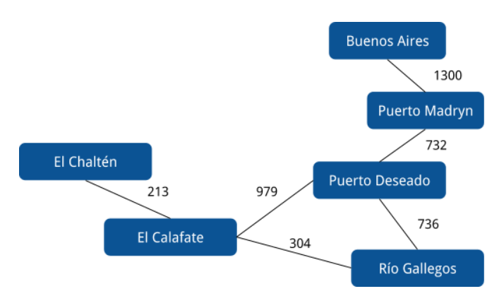

# Rutas

[](https://github.com/pdep-utn/eg-rutas-prolog/actions)

Ejercicio de Rutas que permite encontrar la distancia en kilómetros entre dos ciudades pasando por diferentes rutas.



Este ejemplo tiene dos soluciones:

- **master**: en este branch está la solución original y la que recomendamos pensar para los ejercicios prácticos y el parcial
- **tabling**: como idea novedosa, podés ver el concepto de **tabling** que tiene el motor de inferencia Prolog

Para moverte al branch tabling, clonás el Repo como siempre, vas a la carpeta donde está descargado este ejemplo y desde la consola o Git Bash escribís

```bash
git checkout tabling
```

y luego trabajás normalmente.